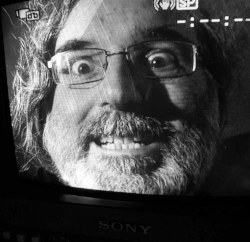

---
hide:
  - navigation
  - toc
---

[Site map](sitemap.md))
[Home](index.md) > **About**

---
# About the Durango Project

Durango is a project developed by [zuiko21](https://twitter.com/zuiko21/),
with the help of [La Jaquería](https://lajaqueria.org), to create a computer
using the 6502 microprocessor with its own architecture.

This is an Open Hardware and Open Source Software Project. You can find all our
projects in our [Github Organization](https://github.com/durangoretro/).

## Durango Computer Team

The Durango Computer Team is the people behind the project, working together to
design and implement the [hardware](hardware.md) and [software](software.md) for Durango.

Of course [everyone can become part of the Durango Computer Team](community.md),
thanks to the open Hardware and Open Source initiative. Here you can find the
core people of the Durango Computer Team:

| **Zuiko21** | **Emiliollbb** | **Zerasul** |
|:-----------:|:--------------:|:-----------:|
||||
|6502 Guru. Father of Durango-X|Born in the 80's, always looking for cool projects to learn from|Software Engineer that loves the retro world.|
