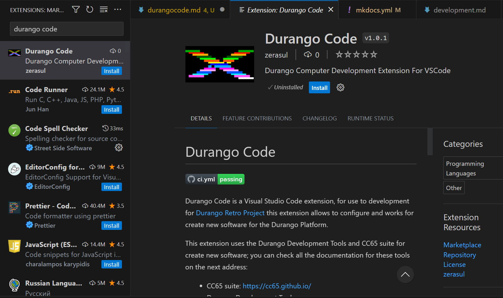
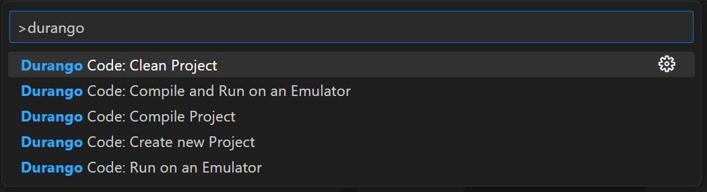

[Home](../index.md) > [Development](../../tools/development.md) > **Durango Code**
___
# Durango Code

Durango Code is a [Visual Studio Code](https://code.visualstudio.com/) extension; this extension allows you to configure and use the Durango Development tools like:

* CC65 suite.
* Durango Lib.
* Rescomp Java Application.
* Docker Durango Dev Kit Image.

This extension adds some commands for use with Durango Based Projects:

* Create new Hello World Durango Project.
* Compile the current Durango Project.
* Clean the current Durango Project.
* Run the current Durango Project using an Emulator.
* Run the current Durango Project using the Nanoboot application for send to a Durango machine (only for Raspberry Pi).
* Compile and Run on an Emulator.

!!! note
    This extension is under development and the features can change; please see changelog or the Github repository for more information.

## Installation

You can install Durango Code from the extension marketPlace using the Extension tab on Visual studio Code; just search "Durango Code" and press install.

<figure markdown>

<figcaption>Durango Code Extension Installation</figcaption>
</figure>

!!! note
    Durango Code is compatible with Visual Studio Code 1.75 or higher.

Also, you can install manually from the Durango Code Release page:

[https://github.com/durangoretro/durangocode/releases](https://github.com/durangoretro/durangocode/releases).

Just download the .vsix file, and press on Visual studio code <kbd>ctrl</kbd>+<kbd>shift</kbd>+<kbd>p</kbd> later, select the _Extensions: install from vsix..._.

## Configuration

Before use Durango Code, you need to configure the extension; you can find the Configuration pressing <kbd>ctrl</kbd>+<kbd>,</kbd> or select the _File->Preferences->settings_ menu.

Durango Code have the next Configuration to custom your Durango Development Tools installation:

* ```Perdita Path```: The current Durango-x Emulator executable Path.
* ```NanoBoot Path```: The current NanoBoot executable Path.
* ```DDK```: Overrides the current ```DDK``` environment Variable.
* ```Custom Rescomp Jar```: Custom Rescomp Jar application path. By default is on ```$DDK/rescomp/rescomp.jar```.
* ```romLocation```: Location where the Rom is generated after compilation. By default is _rom.dux_.
* ```DockerImageName```: Durango Dev Kit Docker Image Name; by default ```zerasul/durangodevkit```.
* ```toolchain Type```: Select the current Toolchain type:
    * ```Native```: Use Native Commands (Depends on Operating System).
    * ```Docker```: Use Docker Image implementation.

## Usage

To use the Durango Code commands you need to enter to the VScode Commands palette (<kbd>ctrl</kbd>+<kbd>shift</kbd>+<kbd>p</kbd>) and see the commands starting with ```Durango Code:```.

<figure markdown>

<figcaption>Durango Code Commands</figcaption>
</figure>

Select the command and you can see a new Terminal called "durango.code" with the result of the command.

For more information about Durango Code or add some issues, please see the Github Repository:

[https://github.com/durangoretro/durangocode/](https://github.com/durangoretro/durangocode/)
