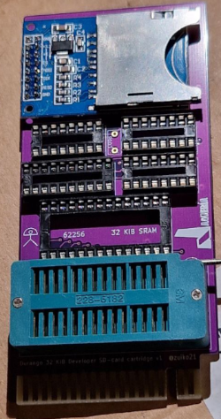

# Durango Development RAM Cartridge

<figure markdown>

<figcaption>Durango Development RAM Cartridge</figcaption>
</figure>

The **Durango-X _Development_ RAM Cartridge** allows to [load programs using an **SD Card**](../software/header.md) interface.

This cartridge adds an additional **32KiB static RAM** to Durango-X _on the same address space_ as the cartridge ROM, effectively upgrading the computer to a whole **64 KiB RAM** system.

The [firmware ROM](../cartidge.md) can be switched off, allowing the underlying RAM to execute its contents. After downloading, _cartridge RAM writes can be disabled_, making it as reliable as running from a standard ROM chip.

Also, you can use this cartridge to load programs using the _nanoLink_ interface into the cartridge RAM. You can send programs to Durango-X using a _Raspberry Pi_ connected using GPIO.
