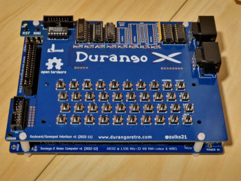

# Durango Retro

**A retro-inspired architecture**

Welcome to Durango Computer Web Page.

Durango is an Open Source and Open hardware project to create a Retro computer system, using the 6502 processor. From the creation of all the hardware architecture, to all the tools and information to create a new Development System for this computer.

<figure markdown>

<figcaption>Durango Computer</figcaption>
</figure>

In this web page you can find all the information about this project; from the creation of a new Durango computer using the schematics, Software created or all the software tools created to develop new programs and games for this computer.

<figure markdown>

<figcaption>Durango Computer With KeyBoard 
 and controller Interface</figcaption>
</figure>

Of course there is more; we are trying to create all the tools, software and libraries needed to develop new software using modern tools like Docker images or creating user friendly libraries.

This project is made with the collaboration of [La Jaquería](https://lajaqueria.org).
