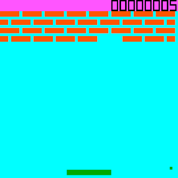
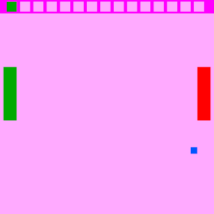

# Games

Here you can download ROM images with games, and their Source Code.

## Games to Download

### Breakout

<figure markdown>

<figcaption>Durango Breakout Game</figcaption>
</figure>

breakout.dux Breakout/Arkanoid Game for Durango.

* [ROM](../assets/bin/breakout.dux).
* [Source Code](https://github.com/durangoretro/arkanoid).

### Pacman

<figure markdown>

<figcaption>Durango Pacman Game (Poc)</figcaption>
</figure>

* pacman.bin : Pacman for Durango (under development).

* [ROM](../assets/bin/pacman.bin)
* [Source Code]()

### Pong

<figure markdown>

<figcaption>Durango Pong Game (Poc)</figcaption>
</figure>

_pong.dux_ . Pong Game for Durango. This is a Two Player Game. Compatible with Gamepads.

* [ROM](../assets/bin/pong.dux)
* [Source Code](https://github.com/durangoretro/durango_demos/blob/main/pong.s).

### Witch (halloween 2022)

<figure markdown>

<figcaption>Durango Witch Game</figcaption>
</figure>

* witch.dux . 2022 Halloween game (under development). Press AWSD keys to move.

* [ROM](../assets/bin/witch.dux).
* [Source Code](https://github.com/durangoretro/witch).

### Telesketch

<figure markdown>

<figcaption>Durango telesketch Game</figcaption>
</figure>

_telesketch.dux_ : Etch-a-sketch  Durango Game. Press AWSD to draw the line.

* [ROM](../assets/bin/telesketch.bin)
* [Source Code](https://github.com/durangoretro/telesketch).

### Columns

<figure markdown>

<figcaption>Durango Columns Game</figcaption>
</figure>

* columns.bin : Puzzle Durango Game (Under Development). Press Start to begin, directions to move the pieces and A,B,(C) to rotate.

* [ROM](../assets/bin/columns.dux)
* [Source Code]()
