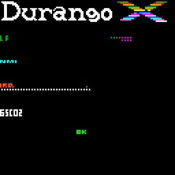

[Home](../index.md) > [Software](software.md) > **Utility Software**
___
# Utility Software

Here you can find information about Durango's programs or utilities.

## Download

You can download the Binary ROM image, or see the source code.
_Most of the assembly source code can be assembled with the [xa65](https://www.floodgap.com/retrotech/xa/) assembler_.

!!! note

	Most of these **ROM images** are intended to be used with the Perdita emulator, or [downloaded into an SD card](header.md) for bootstrapping. In order to "blow" an EPROM/EEPROM with them, _make sure the contents stay **at the end** of the memory range_, adding an appropriate _leader_ (usually consisting of `$FF`s) to match your chip's capacity, if needed.

### EhBASIC

<figure markdown>

<figcaption>EhBASIC for Durango-X</figcaption>
</figure>

_basic.dux_: EhBASIC Interpreter. With this ROM you can run BASIC programs in your Durango. This is an _MS-BASIC_-based interpreter, but it adds Durango-specific BASIC commands for **graphics, colour and sound**.

* [ROM image](../assets/bin/basicgr.dux) (32 KiB, _EPROM/EEPROM-ready_)
* [Source Code](https://github.com/zuiko21/minimOS/blob/ehgraph/forge/eh_basic/ehbasic_sa.s)

More information about EhBASIC interpreter:

* [EhBASIC Reference Manual](http://retro.hansotten.nl/uploads/leedavison/Enhanced_6502_BASIC_reference_manual.pdf).
* [Durango-Specific BASIC Commands](ehbasic.md)

### Nano Python

Durango Python Interpreter (Proof-of-Concept) _under development_.

### nanoBoot

This is the **bootstrap firmware** loader from a Raspberry Pi or SD card).

With this ROM you can launch _ROM images_ using the **nanoLink** interface connected to a _Raspberry Pi_, or from an SD card. _Needs the [Development Cartridge](../hardware/dev_cart.md)_.

* [Bootstrap ROM](../assets/bin/nanoboot.dux) (16 KiB, _EPROM/EEPROM-ready_) for RasPi & SD.
* [Source Code](https://github.com/zuiko21/minimOS/blob/master/forge/nanoboot/rom.s) depends on some other files, check `#include`s.

There is an specific version for the **SD card** interface] on the _Development Cartridge_; it allows **selection** between _several concatenated_ [ROM images](header.md) to boot, plus works as a [**_screen dump_ viewer**](filesys.md) (both HIRES and colour modes):

* [Bootstrap ROM](../assets/bin/multi.dux) (16 KiB, _EPROM/EEPROM-ready_), SD card only.
* [Source Code](https://github.com/zuiko21/minimOS/blob/master/forge/nanoboot/multi.s) depends on some other files, check `#include`s.

For more information, please see [Raspberry Pi Server tool Section](../tools/tools.md#raspberry-pi-durango-servernano-boot) and the [ROM images in SD card section](multiboot.md)

### GamePads Tester _(standalone)_

<figure markdown>

<figcaption>Durango-X Gamepads Test</figcaption>
</figure>

* _gamepads.bin_ : Standalone Durango Gamepad Tester; Press Gamepad buttons to check that they're working. _This test is compatible with the integrated 40-key Keyboard and gamepad interface_.

* [ROM](../assets/bin/gamepads.dux)
* [Source Code](https://github.com/durangoretro/durango_demos/blob/main/gamepads.s)

### Keyboard Tester _(standalone)_

<figure markdown>

<figcaption>Durango Keyboard Test</figcaption>
</figure>

* _keyboard_tester.bin_ : Standalone Durango Keyboard Tester. Press keyboard buttons to check that it's working properly. _This test is compatible with the integrated 40-key Keyboard and gamepad interface_.

* [ROM](../assets/bin/keyboard_tester.dux).
* [Source Code](https://github.com/durangoretro/durango_demos/blob/main/keyboard_tester.c).

!!! note

	If three or more keys are pressed _at the same time_, **ghosting** may happen. The simple matrix used on the 40-key Keyboard cannot avoid this, unfortunately.
	
### Durango Full Test

<figure markdown>

<figcaption>Durango Full Test</figcaption>
</figure>

* _fulltest.dux_ : Full Hardware Test for Durango and basic peripherals; use `NMI` (F2 on perdita) key to cycle between all tests. _Includes a compact version of the gamepads & keyboard tests above_.

* [ROM](../assets/bin/fulltest.dux)
* [Source Code](https://github.com/zuiko21/minimOS/blob/master/forge/test/fulltest.s) depends on some other files, check `#include`s.

For more information about Full Test, please check [Full Test documentation page](fulltest.md).
