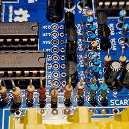

---
hide:
  - toc
---
[Site map](../../../sitemap.md))
[Home](../../../index.md) > [Getting Started](../../../started.md) > [Building](../../building.md) > [Durango·X](../durango.md) > **Step-by-step**

---
# Building the Durango computer, step-by-step

## General guidelines

Please check [the general guidelines](../general.md) for building these PCBs, but **do not attempt soldering _until you have read this document IN FULL_**.

## Critical points

Besides the aforementioned guidelines, you must pay attention to some items on the Durango·X PCB:

- ***IOx*** and _**Expansion** (sidecar)_ connectors **must be placed ABSOLUTELY FLUSH to the board**, otherwise fitting peripherals may become difficult or right impossible!
- If you plan to use the suggested [keyboard/gamepads interface board](keyboard.md), **do NOT solder `D6` and `D4` _yet_** (`POWER` and `ERROR` LEDs) as they must be set at the _proper height_ in order to be visible over the keyboard PCB.

Make sure to read the **hack and fixes** section according to your PCB's revision.

### Video output options

!!! tip

	Except for the _overlapping output connectors_, **all components** can be soldered no matter the chosen video option (although some values may differ)

- The **SCART** connector (`J905` in v2+, `J105` in v1) and the 3x RCA for **Sync-on-green** (v1, `J005`) or **Component video** (v2+, `J605`) do _overlap_, thus only one can be physically mounted.
- The 3x RCA for the **second video output** (`J706` in v2+, `J6` in v1) _may be desired for the **Component video** option_, as audio is always available there. _That second video output won't be enabled unless the associate components for the **second output** (`C709`, `R731` on v2+; `C9`, `R31` on v1) are fitted_.

## Hacks and fixes

### FIX colours when using the _Component video adapter_ board (v1)

Make sure the proper [Luminance DAC values](../../../hard/dx.md) are used in the Durango·X PCB. In short:

|Designator|Silkscreen values|Luminance values|
|----------|-----------------|----------------|
|`R107`    |5K6              |**8K2**         |
|`R109`    |22K              |**18K**         |
|`R110`    |39K              |**33K**         |

!!! tip

	v2+, even if using the SCART option, bear the new Luminance values in the silkscreen.

### FIX unstable or missing image on the _Component video_ option (v2-v2.1)

1. Make sure resistors `R911` thru `R914` are fitted (even if they were intended for SCART only)
1. Ground the SCART red, green and blue outputs, by putting jumper wires between **pins 7-9, 11-13 and 15-17** of (non-installed) `J905` -- or connect those 6 pins together, as preferred.

<figure markdown>

<figcaption>Do not fit these resistors as indicated on the silkscreen!</figcaption>
</figure>

!!! tip

	v2.2+ renames those resistors as `R111` thru `R114`, making them compulsory whenever the colour mode is used, no matter the interface. **Solder bridges** are provided on the PCB's front side for convenience. 

### FIX colours on the _Component video_ option (v2-v2.1)

Original silkscreen shows wrong values, resulting on weird colours. **Use these values** instead:

|Designator|Silkscreen values|Corrected values|
|----------|-----------------|----------------|
|`R643`    |4K7              |**6K2**\*       |
|`R644`    |12K              |**22K**         |
|`R645`    |22K              |**47K**         |
|`R646`    |56K              |**82K**         |
|`R653`    |4K7              |**6K2**\*       |
|`R654`    |15K              |**33K**         |
|`R655`    |27K              |**62K**\*\*     |
|`R656`    |33K              |**39K**         |

\*) Theoretically, this is the most accurate value from E24 series, but **5K6** from the standard E12 series seems to work just fine.

\*\*) Theoretically, this is the most accurate value from E24 series, but **56K** from the standard E12 series seems to work just fine.

<figure markdown>

<figcaption>Do not fit these resistors as indicated on the silkscreen!</figcaption>
</figure>

!!! tip

	This is **fixed** in v2.2+ _(using 5K6 and 56K values)_

### Image is shifted to the left in v2-v2.1

In the original design (v1), image was not perfectly centered on screen by design, but slightly towards the right. For v2.0 and v2.1 there is a design error which _notably_ shifts the display to the left. _It is fully fuctional_ and the whole screen area is visible, but not as aesthetically pleasing, especially now with **perfectly square pixels**...

The fix for this is a relatively simple mod, all done within the back of the board:

1. Cut the connections to pins **9** and **11** of `U18` (coming from the left hand side, towards the video connectors)
1. Use a bodge wire to connect **`U18` pin 9** to **`U22` pin 15**
1. Use a bodge wire to connect **`U18` pin 11** to **`U22` pin 14** (or, alternatively, to the nearby via next to pin 9 of `U18`, if possible)

<figure markdown>

<figcaption>Cut these traces</figcaption>
</figure>

<figure markdown>

<figcaption>Place these bodge wires</figcaption>
</figure>

!!! tip

	This is completely **fixed** in v2.2+

### Somewhat unstable horizontal sync, especially in TURBO mode (v2+)

Use a 74**AC**4040 for `U15` instead of the _HC_ version. Unfortunately, _these are somewhat hard to come by, especially in DIP package as required by this board_.

!!! tip

	v2.2 already states `74AC4040` on the silkscreen.
