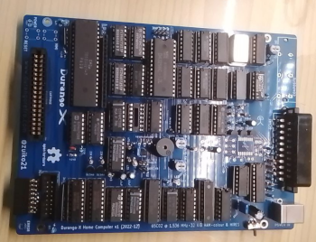

# Getting Started

Here you cand find information about how to Start with the Durango Computer

## Description
Durango is made from two PCBs: The actual [SBC](https://en.wikipedia.org/wiki/Single-board_computer), 
and a peripheral board with a keyboard and two gamepad sockets. The peripheral board can be built to support either NES gamepads or Megadrive/Genesis gamepads (including Atari VCS/2600-style joysticks).

## Build your own Durango

If you want to create a new Durango computer, you need to download the blueprints and obtain the components; you can find the blueprints in the following link:

[https://github.com/zuiko21/minimOS/tree/master/hard/kicad/durango/full](https://github.com/zuiko21/minimOS/tree/master/hard/kicad/durango/full)

To open the blueprints you need the [KiCad](https://www.kicad.org/) application.

You will need the symbols library for this project:

[https://github.com/zuiko21/minimOS/tree/master/hard/kicad/symbols](https://github.com/zuiko21/minimOS/tree/master/hard/kicad/symbols)

You can render in Kicad an image similar to:

<figure markdown>

<figcaption>Durango PCB with components</figcaption>
</figure>

### Durango Main Board. Bill of Materials

#### Board
* PCB [Gerbers for JLCPCB ordering](assets/bin/durango-x1-zuiko21.zip) [KiCad source files](https://github.com/zuiko21/minimOS/tree/master/hard/kicad/durango/full)

#### Sockets
* 14-pin (x9)
* 16-pin (x19)
* 20-pin (x5)
* 28-pin (x1)
* 40-pin (x1)

#### Resistors (all 1/8 Watt unless noted otherwise)
* 27   (x1) (RED VIOLET BLACK) 1/2 Watt
* 68   (x2) (BLUE GREY BLACK)
* 120  (x1) (BROWN RED  BROWN)
* 150  (x1) (BROWN GREEN BROWN)
* 330  (x1) (ORANGE ORANGE BROWN)
* 470  (x3) (YELLOW VIOLET BROWN)
* 680  (x2) (BLUE GREY BROW)
* 1K   (x3) (BROWN BLACK RED)
* 1K2  (x1) (BROWN RED  RED)
* 3K3  (x4) (ORANGE ORANGE RED)
* 5K6  (x1) (GREEN BLUE RED)
* 6K8  (x2) (BLUE GREY RED)
* 12K  (x3) (BROWN RED ORANGE)
* 22K  (x3) (RED RED ORANGE)
* 39K  (x1) (ORANGE WHITE ORANGE)
* 220K (x3) (RED RED YELLOW)

#### Resistor networks
* 4x 4K7, 5-pin (x1)
* 8x 3K3, 9-pin (x1)

#### Capacitors
* 68 pF  (x1)
* 0.1 uF (x5)     _three of them for the **optional** composite-PAL output_
* 10 µF  (x2) 25V _any rating 10 Volts or more will do, preferably as small as possible_
* 100 µF (x3) 10V
* 470 µF (x1) 10V

#### Semiconductors
* 1N4148         (x5)
* BC548B         (x6) _or any other small-signal NPN transistor (e.g. 2N3904, but check pinout!)_
* Red 3 mm LED   (x1)
* Green 3 mm LED (x1)

#### Integrated Circuits
* 74HC00   (x1)
* 74HC02   (x1)
* 74HC20   (x1)
* 74HC21   (x1)
* 74HC32   (x1)
* 74HC74   (x1)
* 74HC85   (x2)
* 74HC86   (x2)
* 74HC132  (x1)
* 74HC139  (x2)
* 74HC157  (x4)
* 74HC166  (x1)
* 74HC174  (x1)
* 74HC175  (x1)
* 74HC245  (x3)
* 74HC257  (x4)
* 74HC367  (x1)
* 74HC574  (x1)
* 74HC688  (x1)
* 74HC4040 (x3)
* 65C02    (x1)
* 27C256   (x1) _for the ROM cartridge_

#### Oscillator can
* 24.576 MHz (x1)

#### Others
* Piezo Buzzer               (x1)
* 6x6x21 mm Tactile switch   (x2)
* IDC shrouded 16-pin header (x1)
* SCART 21-pin connector     (x1)
* 3x RCA socket              (x1) _optional_

#### _Optional_ for composite PAL output
* 10 pF            (x1) 
* 22 nF            (x1)
* AD724            (x1) _**surface-mounted device**_
* 4.43 MHz crystal (x1)

### Durango Keyboard & Gamepads Board. Bill of Materials (NES flavour)
The Keyboard & Gamepads Board provides an integrated keyboard and two Gamepad ports (MegaDrive/Genesis/Atari 2600 or NES-type gamepad options).

<figure markdown>

<figcaption>Durango KeyBoard & Gamepad Board</figcaption>
</figure>

#### Top Board (keyboard & NES gamepads)
* PCB [Gerbers for JLCPCB ordering](assets/bin/top5.8kbd1v1.0-zuiko21.zip) [KiCad source files](https://github.com/zuiko21/minimOS/tree/master/hard/kicad/top5x8kbd)

#### Sockets
* 14-pin (x1)
* 16-pin (x4)
* 20-pin (x1)

#### Passive devices
* 1N4148 diode                     (x8)
* Resistor network 8x 220K, 9-pin  (x1)
* Resistor network 8x 10K,  9-pin  (x1)

### Other
* NES Socket                   (x2)
* Tactile Switch DIP-4 6x6x7mm (x40)
* IDC Shrouded 16-pin header   (x2)  _2x8_
* 8-pin socket, long pins      (x2)  _might use a single unit in 2x8 configuration, if available_

#### Integrated Circuits
* 74HC138 (x1)
* 74HC86  (x1)
* 74HC174 (x1)
* 74HC245 (x1)
* 74HC595 (x2)

### Assembly instructions
* Mount diodes: D11, D12, D13, D4, D15, D16, D17, D18
* Mount sockets: U9 U13, U12, U1
* Mount sockets: U34, U55
* Mount resistors: RN11, RN3
* Mount IDC: J1, J2
* Mount NES sockets: J33, J54
* Mount switches: SW1 to SW40

### Durango Keyboard & Gamepads Board. Bill of Materials (MD/Genesis/VCS flavour)

#### Top Board (keyboard & MD gamepads)
* PCB [Gerbers for JLCPCB ordering](assets/bin/top5.8kbd1v1.0-zuiko21.zip) [KiCad source files](https://github.com/zuiko21/minimOS/tree/master/hard/kicad/top5x8kbd)

#### Sockets
* 14-pin (x1)
* 16-pin (x3)
* 20-pin (x3)

#### Passive devices
* 1N4148 diode                     (x8)
* Resistor network 8x 220K, 9-pin  (x1)
* Resistor network 8x 10K,  9-pin  (x1)

### Connectors
* DE9 Socket                   (x2)
* Tactile Switch DIP-4 6x6x7mm (x40)
* IDC Shrouded 16-pin header   (x2)  _2x8_
* 8-pin socket, long pins      (x2)  _might use a single unit in 2x8 configuration, if available_

#### Integrated Circuits
* 74HC138 (x1)
* 74HC86  (x1)
* 74HC174 (x2)
* 74HC245 (x3)

### Assembly instructions
* Mount diodes: D11, D12, D13, D4, D15, D16, D17, D18
* Mount sockets: U9 U13, U12, U1, 
* MOunt sockets: U26, U24, U45
* Mount resistors: RN11, RN22, RN3
* Mount IDC: J1, J2
* Mount DE9: J23, J44
* Mount switches: SW1 to SW40

## Durango Cartridge

<figure markdown>

<figcaption>Durango Cartridge</figcaption>
</figure>

Here you can find the ROM Cartridge:

PCB  [Gerbers for JLCPCB ordering](assets/bin/cart28p1v1.0-zuiko21.zip) [KiCad source files](https://github.com/zuiko21/minimOS/tree/master/hard/kicad/durango/cartridges/cart28p)

### Bill Of Materials (28-pin Durango Cartridge)

### Cartridge configuration

You may leave 3K3 resistors in R1 & R2 positions, with pin headers on JP1 & JP2, for easy ROM type switching. On the other hand, if a particular cartridge is to be used with a single type of ROM chip, it may be permanently wired as follows:

_Suitable ROM chips and jumper Configuration_

|  Type  |      Model     | Capacity | JP1 |  JP2 | R1 | R2 |
|:------:|:--------------:|:--------:|:---:|:----:|:--:|:--:|
| EPROM  |          27C64 |      8KB |  -  | -    | 0  | 0  |
| EPROM  |         27C128 |     16KB |  -  | -    | 0  | 0  |
| EPROM  |         27C256 |     32KB |  ON | -    | -  | 0  |
| EPROM  | 27C512 (lower) |     64KB |  ON | UP   | -  | -  |
| EPROM  | 27C512 (upper) |     64KB |  ON | *    | -  | -  |
| EEPROM |          28C64 |      8KB |  -  | -    | 0  | -  |
| EEPROM |         28C256 |     32KB |  -  | DOWN | 0  | -  |
| FLASH  |         29F256 |     32KB |  -  | -    | -  | 0  |

**0** = jumper wire, **-** = not connected.

## Built Software for Durango

If you want to built your own Durango Software (like Games or applications), you don't need a Durango to Built Software.

We built some Tools for improve the development of software with Durango. Like:

* Emulator
* Developer-friendly C Library (Durango Lib)
* Durango Docker Image
* Visual Studio Code Extensión (Durango Code)

You can use the Durango Emulator (Perdita), to test your ROMs and play Durango Games; or use the development tools for create your own Durango Applications.

You can find them in the [Development & Tools section](/tools/development/).
