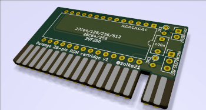

# Getting Started

Here you cand find information about how to Start with the Durango Computer

## Description
Durango is build up of two pcb boards: The actual [SBC](https://en.wikipedia.org/wiki/Single-board_computer) board, 
and a peripheral board with a keyboard and two gamepads sockets. The peripheral board can be build to support either NES gamepads or Megadrive gamepads

## Build your own Durango

If you want to Create a new Durango Computer, you need to download the Blueprints and obtain the components; you can find the blueprints in the next link.

[https://github.com/zuiko21/minimOS/tree/master/hard/kicad/durango/full](https://github.com/zuiko21/minimOS/tree/master/hard/kicad/durango/full)

To open the blueprints, you need the [Kicad](https://www.kicad.org/) application.

You will need the Symbols library for this project:

[https://github.com/zuiko21/minimOS/tree/master/hard/kicad/symbols](https://github.com/zuiko21/minimOS/tree/master/hard/kicad/symbols)

You can see in Kicad an image similar to:

<figure markdown>

<figcaption>Durango PCB with components</figcaption>
</figure>

### Durango SBC Board. Bill of Materials

#### Board
* PCB [JLPCB ZIP](assets/bin/durango-x1-zuiko21.zip) [SRC Kicad](https://github.com/zuiko21/minimOS/tree/master/hard/kicad/durango/full)

#### Sockets
* 14 pins (x9)
* 16 pins (x19)
* 20 pins (x5)
* 28 pins (x1)
* 40 pins (x1)

### Resistors
* 27   (x1) (RED VIOLET BLACK)
* 68   (x2) (BLUE GREY BLACK)
* 120  (x1) (BROWN RED  BROWN)
* 150  (x1) (BROWN GREEN BROW)
* 330  (x1) (ORANGE ORANGE BROW)
* 470  (x3) (YELLOW VIOLET BROW)
* 680  (x2) (BLUE GREY BROW)
* 1K   (x3) (BROW BLACK RED)
* 1K2  (x1) (BROW RED  RED)
* 3K3  (x4) (ORANGE ORANGE RED)
* 5K6  (x1) (GREEN BLUE RED)
* 6K8  (x2) (BLUE GREY RED)
* 12K  (x3) (BROW RED ORANGE)
* 22K  (x3) (RED RED ORANGE)
* 39K  (x1) (ORANGE WHITE ORANGE)
* 220K (x3) (RED RED YELLOW)
* RN 4x5-pin 4K7 (x1)
* RN 8x9-pin 3K3 (x1)

#### Other Passive devices
* 10 pF  (x1)
* 68 pF  (x1)
* 22 nF  (x1)
* 0.1 uF (x5)
* 10 uF  (x2)
* 100 uF (x3)
* 470 uF (x1)
* 1N4148 (x5)
* BC548  (x6)

#### Integrateds
* 24.576 MHz (x1)
* 74HC00   (x1)
* 74HC02   (x1)
* 74HC20   (x1)
* 74HC21   (x1)
* 74HC32   (x1)
* 74HC74   (x1)
* 74HC85   (x2)
* 74HC86   (x2)
* 74HC132  (x1)
* 74HC139  (x2)
* 74HC157  (x4)
* 74HC166  (x1)
* 74HC174  (x1)
* 74HC175  (x1)
* 74HC245  (x3)
* 74HC257  (x4)
* 74HC367  (x1)
* 74HC574  (x1)
* 74HC688  (x1)
* 74HC4040 (x3)
* 62C02    (x1)
* 27C256   (x1)

### Optional
* AD724    (x1)
* 4.43 MHz (x1)

#### Others
* Red LED        (x1)
* Green LED      (x1)
* Buzzer         (x1)
* Tactile switch (x2)
* IDC            (x1)

### Durango Keyboard & Gamepads Board. Bill of Materials (NES flavour)
The KeyBoard & GamePads Board, allow to use a integrated KeyBoard and connect GamePads (MegaDrive/Atari 2600 or NES GamePads Compatible).

<figure markdown>

<figcaption>Durango KeyBoard & Gamepad Board</figcaption>
</figure>

#### Top Board (keypad & NES gamepads)
* PCB [JLPCB ZIP](assets/bin/top5.8kbd1v1.0-zuiko21.zip) [SRC Kicad](https://github.com/zuiko21/minimOS/tree/master/hard/kicad/top5x8kbd)

#### Sockets
* 14 pins (x1)
* 16 pins (x4)
* 20 pins (x1)

#### Passive devices
* Diode 4148        (x8)
* RN 8x9-pin 220K  (x1)
* RN 8x9-pin 10K   (x1)

### Connectors
* NES Socket       (x2)
* Tactile Switch DIP-4 6x6x7mm (x40)
* IDC 16(2x8) pin  (x2)
* TO COMPUTER      (x1)

#### Integrated Circuits
* 74HC138 (x1)
* 74HC86  (x1)
* 74HC174 (x1)
* 74HC245 (x1)
* 74HC595 (x2)

### Assembly instructions
* Mount diodes: D11, D12, D13, D4, D15, D16, D17, D18
* Mount sockets: U9 U13, U12, U1
* Mount sockets: U34, U55
* Mount resistors: RN11, RN3
* Mount IDC: J1, J2
* Mount NES sockets: J33, J54
* Mount switches: SW1 to SW40

#### Top Board (keypad & MD gamepads)
* PCB [JLPCB ZIP](assets/bin/top5.8kbd1v1.0-zuiko21.zip) [SRC Kicad](https://github.com/zuiko21/minimOS/tree/master/hard/kicad/top5x8kbd)

#### Sockets
* 14 pins (x1)
* 16 pins (x3)
* 20 pins (x3)

#### Passive devices
* Diode 1N4148        (x8)
* RN 8x9-pin 220K  (x2)
* RN 8x9-pin 10K   (x1)

### Connectors
* DE9 Socket       (x2)
* Tactile Switch DIP-4 6x6x7mm (x40)
* IDC 16(2x8) pin  (x2)
* TO COMPUTER      (x1)

#### Integrated Circuits
* 74HC138 (x1)
* 74HC86  (x1)
* 74HC174 (x2)
* 74HC245 (x3)

### Assembly instructions
* Mount diodes: D11, D12, D13, D4, D15, D16, D17, D18
* Mount sockets: U9 U13, U12, U1, 
* MOunt sockets: U26, U24, U45
* Mount resistors: RN11, RN22, RN3
* Mount IDC: J1, J2
* Mount DE9: J23, J44
* Mount switches: SW1 to SW40

## Durango Cartridge

<figure markdown>

<figcaption>Durango Cartridge</figcaption>
</figure>

Here you can find the Cartridge for built each Rom:

PCB  [JLPCB ZIP](assets/bin/cart28p1v1.0-zuiko21.zip) [SRC Kicad](https://github.com/zuiko21/minimOS/tree/master/hard/kicad/durango/cartridges/cart28p)

### Bill Of Materials (Durango Cartridge)

### Cartridge configuration

ROM Chip compatibles and Configuration.

|  Type  |      Model     | Capacity | JP1 |  JP2 | R1 | R2 |
|:------:|:--------------:|:--------:|:---:|:----:|:--:|:--:|
| EPROM  |          27C64 |      8KB |  -  | -    | 0  | 0  |
| EPROM  |         27C128 |     16KB |  -  | -    | 0  | 0  |
| EPROM  |         27C256 |     32KB |  -  | -    | -  | 0  |
| EPROM  | 27C512 (lower) |     64KB |  ON | UP   | -  | -  |
| EPROM  | 27C512 (upper) |     64KB |  ON | -    | -  | -  |
| EEPROM |          28C64 |      8KB |  -  | -    | 0  | -  |
| EEPROM |         28C256 |     32KB |  -  | DOWN | 0  | -  |
| FLASH  |         29F256 |     32KB |  -  | -    | -  | 0  |

* JP1: Jumper 1
* JP2: Jumper 2
* R1: Resistor 1 connected
* R2: Resistor 2 connected

## Built Software for Durango

If you want to built your own Durango Software (like Games or applications), you don't need a Durango to Built Software.

We built some Tools for improve the development of software with Durango. Like:

* Emulator
* Friendly Use C Library (Durango Lib)
* Durango Docker Image
* Visual Studio Code Extensión (Durango Code)

You can use the Durango Emulator (Perdita), to test your ROMs and play Durango Games; or use the development tools for create your own Durango Applications.

You can find them in the [Development & Tools section](/tools/development/).
